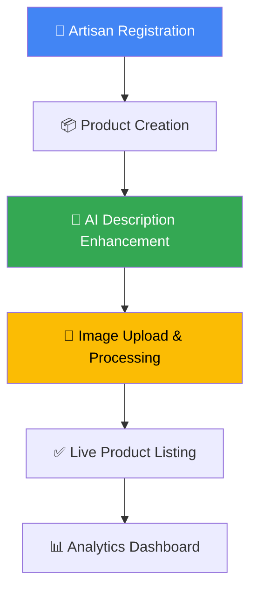

# 🔄 KALA KAKSH - Complete Workflow Guide




---

##  **Step-by-Step Workflow**

### **Step 1: Artisan Registration** 👤

**Endpoint**: `POST /api/artisans`

```json
{
  "name": "Kavita Sharma",
  "email": "kavita.embroidery@gmail.com",
  "phone": "9876543210",
  "craft_type": "Embroidery",
  "location": {
    "city": "Bhuj",
    "state": "Gujarat"
  },
  "bio": "I create mirror work embroidery using techniques my mother taught me.",
  "experience_years": 15
}
```

**System Process**:
1. ✅ **Email uniqueness validation**
2. ✅ **UUID generation** for artisan ID
3. ✅ **JSON persistence** with automatic backup
4. ✅ **Auto-fill** artisan ID in frontend

**Response**:
```json
{
  "success": true,
  "data": {
    "id": "a1b2c3d4-e5f6-7890-abcd-ef1234567890",
    "name": "Kavita Sharma",
    "email": "kavita.embroidery@gmail.com"
  }
}
```

---

### **Step 2: Product Creation** 📦

**Endpoint**: `POST /api/products`

```json
{
  "artisan_id": "a1b2c3d4-e5f6-7890-abcd-ef1234567890",
  "name": "Embroidered Table Runner",
  "description": "Table runner with mirror work",
  "price": 1200,
  "category": "Home Decor",
  "materials": ["Cotton", "Mirrors", "Gold thread"],
  "stock_quantity": 3
}
```

**System Process**:
1. ✅ **Artisan ID validation**
2. ✅ **Product data validation**
3. ✅ **UUID generation** for product ID
4. ✅ **Price formatting** and stock management
5. ✅ **Auto-fill** product ID for image upload

---

### **Step 3: AI Description Enhancement** 🤖

**Endpoint**: `POST /api/enhance-description-preview`

```json
{
  "description": "Table runner with mirror work",
  "product_name": "Embroidered Table Runner",
  "craft_type": "Embroidery",
  "materials": ["Cotton", "Mirrors", "Gold thread"]
}
```

**Google AI Processing**:
```
┌─────────────────┐    ┌──────────────────┐    ┌─────────────────┐
│  Basic Input    │───▶│   Gemini 1.5     │───▶│ Cultural Story │
│  "Mirror work"  │    │   Flash AI       │    │                 │
└─────────────────┘    └──────────────────┘    └─────────────────┘
```

**File Processing Pipeline**:
```
┌─────────────┐    ┌─────────────┐    ┌─────────────┐    ┌─────────────┐
│ Raw Upload  │───▶│ AI Enhance  │───▶│ Optimize    │───▶│ Cloud Store │
│ (Any Format)│    │ (PIL + AI)  │    │ (JPEG/WebP) │    │ (Google CS) │
└─────────────┘    └─────────────┘    └─────────────┘    └─────────────┘
```


### **Data Flow Architecture**
```
Frontend (seller_upload.html)
    ↓
Flask Routes (app.py)
    ↓
Service Layer (services/)
    ↓
Google Cloud APIs
    ↓
JSON Storage (data/)
```


##  **Success Metrics**

### **Technical KPIs**
- ✅ **API Response Time**: < 2 seconds for AI enhancement
- ✅ **Image Processing**: < 5 seconds for optimization
- ✅ **Uptime**: 99.9% availability with fallbacks
- ✅ **Error Rate**: < 1% for core workflows

### **Business KPIs**
- ✅ **Artisan Onboarding**: Complete workflow in < 5 minutes
- ✅ **Product Listing**: End-to-end process in < 3 minutes
- ✅ **Description Quality**: AI enhancement improves engagement
- ✅ **Cultural Authenticity**: Hindi integration maintains tradition

---

**🎨 End-to-End Artisan Empowerment Pipeline**

*Built with Google Cloud • Enhanced by Gemini AI*

</div>
